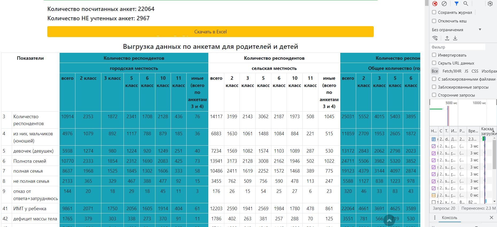

    <h1 align="center">Пример работы в Yii2</h1>

Пример кода, часть моей работы, то чем приходится заниматься 60% рабочего времени - формирование отчетов для анализа данных.

## Примеры реализованно:
1. [Пример формирование отчета 1](#Пример-формирование-отчета-1)
2. [Пример формирование отчета 2](#Пример-формирование-отчета-2)
3. [Пример формирование отчета 3](#Пример-формирование-отчета-3)
4. [Пример работы с GridView](#Пример-работы-с-GridView)

## Пример формирование отчета 1
Пример отчета, акаумулирующий в себе сведения по планируемым и фактическим колличественным показателям, в разрезе федеральных округов и регионов РФ.

____
[:arrow_up:В данном примере реализованно](#В-данном-примере-реализованно)
___

## Пример формирование отчета 2
Пример отчета, формирующий данные в матричном виде, считающий сумму в каждой ячйке по региону, федеральному округу РФ

____
[:arrow_up:В данном примере реализованно](#В-данном-примере-реализованно)
___

## Пример формирование отчета 3
Пример отчета, суммарная выгрузка данных по региону, федеральному округу РФ, а также по организации

____
[:arrow_up:В данном примере реализованно](#В-данном-примере-реализованно)
___

## Пример работы с GridView
Пример работы с GridView, данные связанны из трех таблиц БД + подгрузка в выборку (dropdown) в списки регионов и муниципальных образований, в зависимости от федерального округа и региона соответсвенно   

____
[:arrow_up:В данном примере реализованно](#В-данном-примере-реализованно)
___

